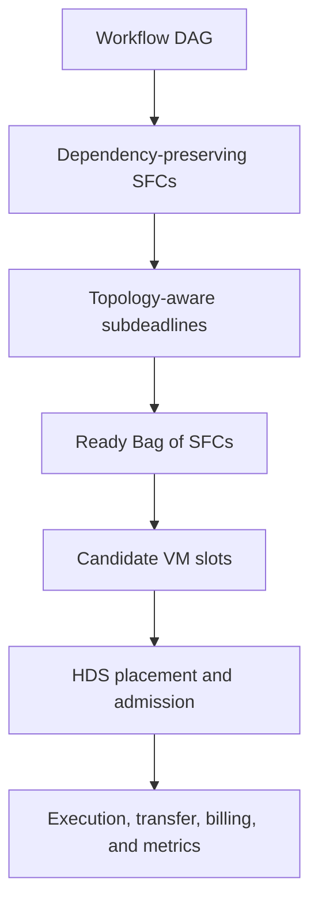

# HDS: Hybrid Deadline-Aware Scheduling in Multi-Tier Fog Computing

This project implements the scheduling method and evaluation used in the HDS
paper. HDS places workflow-derived Service Function Chains (SFCs) across local
and global fog resources while considering workflow dependencies, deadlines,
communication, resource capacity, VM reuse, and provisioning cost.

The package contains the Python simulator and schedulers, experiment drivers,
Pegasus workflow inputs, validated raw and processed results, the MATLAB and
Python figure generators, publication figures, and regression tests.

## Research problem

Latency-sensitive IoT applications are commonly represented as directed
acyclic graphs (DAGs). A task may depend on several parent tasks, and its output
may have to cross a network link before a successor can begin. Scheduling such
workflows in a fog environment is difficult because the scheduler must decide:

- how to preserve forks, joins, and data dependencies when forming SFCs;
- where each ready SFC should run in a heterogeneous local/global topology;
- whether an already paid VM can be reused;
- whether CPU, RAM, storage, link capacity, and deadlines remain feasible;
- how to balance accepted work, provisioning cost, communication, and delay.

HDS addresses these decisions in a static workflow-analysis phase followed by
a dynamic BoS-level scheduling phase.



## HDS method

### 1. Workflow-to-SFC construction

The workflow loader reads a generated workflow, project JSON file, or Pegasus
DAX/XML file. Linear one-parent/one-child regions become SFCs. A fork ends the
current SFC, and a join starts a new SFC. All cross-SFC parent relationships and
their transferred data are retained, including the final output transfer from
a sink task.

### 2. Topology-aware subdeadline assignment

The TASTD static phase derives reference earliest-finish times and allocates
deadlines while reserving the longest remaining downstream execution,
communication, and terminal-output time. This makes the sink deadline represent
the complete workflow deadline rather than only task execution.

### 3. Bags of SFCs

When several SFCs become ready at the same scheduling event, they form a Bag of
SFCs (BoS). HDS evaluates the ready group jointly so that admission, placement,
capacity, VM reuse, communication, and deadline decisions account for
interactions among simultaneously ready SFCs.

### 4. Two-stage HDS optimization

HDS uses a lexicographic two-stage formulation:

1. maximize the number of admitted SFCs in the current BoS;
2. at that admission count, minimize a weighted combination of provisioning
   cost, communication, and completion time.

The paper uses
`(alpha, beta, gamma) = (0.7, 0.2, 0.1)`. The model checks VM activation,
CPU, RAM, storage, link capacity, startup time, non-overlap, internal VNF
deadlines, and terminal delivery. Adaptive fallback preserves a feasible subset
when the complete ready BoS cannot be admitted.

### 5. VM sharing modes

- **Sharable:** several SFCs may use the same VM when sequencing and capacity
  constraints remain feasible.
- **NonSharable:** a candidate VM accepts at most one SFC from the current BoS;
  an idle paid VM may still be reused during a later scheduling event.

HDS uses idle-only VM reuse by default. PBQS uses queue-aware reuse and may put a
new SFC behind work already assigned to an active VM. This difference explains
why sharing can reduce PBQS cost and data transfer while increasing its
end-to-end delay.

## Compared configurations

The main figures compare four configurations:

| Configuration | Scheduler | VM mode | Default reuse |
|---|---|---|---|
| HDS-Sharable | Joint BoS optimization | Sharable | Idle only |
| HDS-NonSharable | Joint BoS optimization | NonSharable | Idle only |
| PBQS-Sharable | Priority-based queue scheduling | Sharable | Queue aware |
| PBQS-NonSharable | Priority-based queue scheduling | NonSharable | Queue aware |

EDF, CostFirst, HDS-NoReuse, and HDS-NoJointBoS are also implemented for
baseline and ablation experiments.

## Experimental environment

The base experiment uses four Pegasus workflow families: Montage,
Epigenomics, Inspiral, and CyberShake.

| Parameter | Base setting |
|---|---|
| Fog topology | 3 local nodes, 2 global nodes, 1 logical edge endpoint |
| Sensors | 10 |
| Local node | 8,000 MIPS, 512 MB RAM, 1,000,000 MB storage |
| Global node | 16,000 MIPS, 2,048 MB RAM, 5,000,000 MB storage |
| Local/global processing elements | 5 / 10 |
| Local/global VM price | $0.005 / $0.01 per 60 s |
| Local/global VM startup | 0.25 s / 0.50 s |
| Edge-local link | 0.5 ms, 100 Mbps |
| Local-global links | 2--3 ms, 1 Gbps |
| Main workflow size | 100 VNFs |
| Deadline experiment | 50 matched seeds per configuration |
| HDS candidate limit | 20 feasible node/VM slots |
| MILP time limit | 15 s per solve |

The complete parameter set is in [`configs/base.yaml`](configs/base.yaml).

## Evaluation studies

### Deadline sensitivity

The deadline matrix contains 24,000 cases: four workflow families, four
scheduler configurations, 30 deadline factors, and 50 matched seeds. It records
global workflow-deadline success separately from compliance with every SFC
subdeadline.

### Deployment scaling

The deployment study contains 800 cases and scales the environment through 60
fog nodes and workflows with 1,000 VNFs. All deployment cases completed without
a deployment solver-limit event. Deployment runtime is reported in the paper's
text rather than as a panel in Figure 6; at the largest deployment, PBQS has a
higher median runtime than HDS because it repeatedly evaluates candidate
placements.

### Controlled BoS-width scaling

The controlled study contains 380 first-round scheduling decisions for BoS
widths from 2 to 20. It reports both first-round scheduling runtime and the
fraction of the submitted ready SFCs admitted in that first decision. This
distinguishes immediate admission from eventual workflow completion.

## Metrics

| Metric | Meaning |
|---|---|
| Provisioning cost | Billed VM cost after applying the 60-second billing interval |
| End-to-end delay | Workflow completion time from release through terminal delivery |
| Transferred data | Data volume sent across network links, in MB |
| CPU/RAM utilization | Used capacity divided by purchased VM capacity |
| Global-deadline success | Whether terminal workflow completion meets the workflow deadline |
| SFC-subdeadline success | Whether every SFC/VNF deadline is satisfied |
| First-round accepted-SFC ratio | SFCs admitted in the first BoS decision divided by SFCs submitted in that decision |
| Scheduler runtime | Time spent making scheduling decisions |
| MILP status | Stage-1/Stage-2 completion, gap, limit, variable, and constraint information |

For Figures 4 and 5, results use paired-success filtering: within each workflow
and seed, a case is retained only when all four main configurations meet the
global deadline. The four workflow means are then weighted equally. This keeps
cost, delay, transfer, and utilization comparisons on the same successful
cases.

## Publication figures and interpretation

The canonical PNG figures are in
[`results/figures_paper_aligned`](results/figures_paper_aligned)

- **Figure 3 — Deadline success:** complete `0.8--3.0` deadline range for
  Epigenomics and CyberShake. Solid lines show global-deadline success; dotted
  lines show all-SFC-subdeadline success.
- **Figure 4 — Cost and delay:** workflow-macro averages over the displayed
  `2.0--5.0` range. Sharing has modest effects on HDS, while PBQS obtains lower
  provisioning cost with higher delay.
- **Figure 5 — Transfer and utilization:** macro-average transferred data plus
  separate CPU and RAM purchased-capacity utilization. PBQS sharing reduces
  transferred data and raises utilization through consolidation; HDS changes
  only slightly.
- **Figure 6 — BoS scalability:** BoS-width scheduling runtime and first-round
  accepted-SFC ratio. HDS-Sharable retains the highest acceptance ratio, but
  joint reuse optimization becomes expensive for wider ready groups and can
  reach the solver limit.

At the representative common-success setting used for the paper's quantitative
summary, sharing reduces provisioning cost by 2.5% for HDS and 26.4% for PBQS.
For HDS, transfer and delay change by +0.9% and +1.4%; for PBQS, transferred
data decreases by 20.6% while delay increases by 20.8%. These are
scheduler-specific trade-offs and should not be merged into one percentage.

## Project structure

```text
HDS_fog_Algorithm_v0.7.0_final/
├── configs/                    Experiment and topology configurations
├── docs/                       Method mapping, validation, and paper text
├── examples/                   Small JSON and DAX workflow examples
├── experiments/                Experiment, analysis, validation, and plotting scripts
├── inputs/pegasus_dax/         Pegasus workflow traces
├── matlab_paper_aligned/       MATLAB generator for Figures 3--6
├── results/
│   ├── raw/                    Three authoritative experiment matrices
│   ├── processed/              Aggregates, paired results, and inference
│   ├── figures_paper_aligned/  Final 300-DPI PNG figures
│   └── figures_paper_aligned_pdf/ Vector PDF figures
├── src/hds/                    Python simulator and scheduling implementation
└── tests/                      Regression and statistical tests
```

## Installation

Python 3.11 or newer is recommended.

```bash
python3 -m venv .venv
source .venv/bin/activate
python3 -m pip install --upgrade pip
python3 -m pip install -e .
```

## Quick checks

Run one simulation:

```bash
hds-sim --family cybershake --size 100 --deadline-factor 1.5 \
  --seed 1 --scheduler hds --sharing sharable
```

Run a small four-configuration experiment:

```bash
PYTHONPATH=src python3 experiments/run_experiments.py \
  --smoke --overwrite --output /tmp/hds_smoke.csv
```

Run the regression suite:

```bash
MPLCONFIGDIR=/tmp/hds-mpl PYTHONPATH=src \
  python3 -m unittest discover -s tests -v
```

## Reproduce the experiment matrices

Deadline sensitivity:

```bash
PYTHONPATH=src python3 experiments/run_experiments.py \
  --families montage,epigenomics,inspiral,cybershake \
  --sizes 100 --seeds 1-50 --candidate-count 20 \
  --deadline-mode reference --reuse-policy auto \
  --solver-time-limit 15 --overwrite \
  --output results/raw/deadline_curves_paper_aligned_50seeds.csv
```

Deployment scaling:

```bash
PYTHONPATH=src python3 experiments/run_deployment_scaling_paper_aligned.py \
  --seeds 5 --kappa 3 --solver-time-limit 15 --overwrite
```

Controlled BoS-width scaling:

```bash
PYTHONPATH=src python3 experiments/run_bos_scaling_paper_aligned.py \
  --kappas 5 --solver-time-limit 15 --overwrite --quiet
```

The complete studies can take substantial time because HDS solves many MILP
instances. Existing validated matrices are included so the analyses and plots
can be reproduced without rerunning every simulation.

## Analyze results and regenerate figures

Run the Python analyzers and release validation:

```bash
PYTHONPATH=src python3 experiments/analyze_results.py
PYTHONPATH=src python3 experiments/analyze_scalability.py
PYTHONPATH=src python3 experiments/analyze_bos_scaling_paper_aligned.py
PYTHONPATH=src python3 experiments/analyze_deadline_curves.py
PYTHONPATH=src python3 experiments/summarize_paper_claims.py

MPLCONFIGDIR=/tmp/hds-paper-mpl PYTHONPATH=src \
  python3 experiments/plot_four_publication_figures_paper_aligned.py

PYTHONPATH=src python3 experiments/validate_release.py
```

The Python renderer writes 300-DPI PNG files to
`results/figures_paper_aligned/` and vector PDFs to
`results/figures_paper_aligned_pdf/`.

To generate the same four-figure structure in MATLAB, open MATLAB in the
project root and run:

```matlab
addpath('matlab_paper_aligned')
report = run_four_figures_paper_aligned;
```

MATLAB reads the three authoritative raw CSV files, validates their row counts
and configuration grids, and writes PNG files to
`results/figures_paper_aligned_matlab/`.

## Expected validation totals

| Dataset | Expected rows | Duplicate cases | Solver-limit rows |
|---|---:|---:|---:|
| Deadline sensitivity | 24,000 | 0 | 0 |
| Deployment scaling | 800 | 0 | 0 |
| Controlled BoS width | 380 | 0 | 45 |

The BoS solver-limit rows occur in the second optimization stage of wide BoS
instances. They are retained and reported; they are not silently discarded.

## Reproducibility notes

- Every plotted marker is based on measured observations; no point is
  interpolated, imputed, or extrapolated.
- Random seeds are matched across scheduler configurations.
- Continuous metrics are compared only on paired globally successful cases.
- The authoritative raw matrices and their validation report are under
  `results/`.
- The reported conclusions are bounded to the included simulator, workload
  traces, topology, parameters, and solver time limit.

